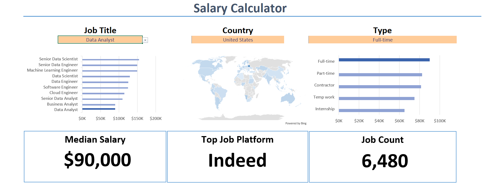

# Excel Salary Dashboard

This project analyzes a dataset to calculate job counts and average salaries across different countries.

The data was filtered and summarized in Excel, and the results were visualized using charts in a dashboard.

Tools used:
- Microsoft Excel
- Pivot Tables
- Charts
- Data Filtering

## Dashboard Preview

## File
Download the Excel file from this repository to explore the dashboard.
